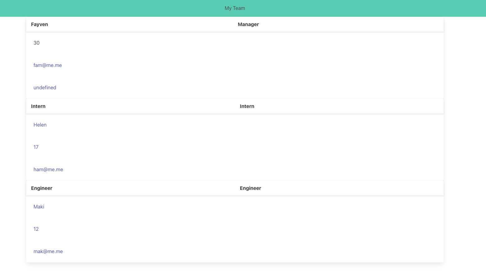

# Team-Profile-Generator

## Technology Used 

| Technology Used         | Resource URL           | 
| ------------- |:-------------:| 
| HTML    | [https://developer.mozilla.org/en-US/docs/Web/HTML](https://developer.mozilla.org/en-US/docs/Web/HTML) | 
| CSS     | [https://developer.mozilla.org/en-US/docs/Web/CSS](https://developer.mozilla.org/en-US/docs/Web/CSS)      |   
| Git | [https://git-scm.com/](https://git-scm.com/)     |    
| JavaScript    | [https://developer.mozilla.org/en-US/docs/Web/JavaScript](https://developer.mozilla.org/en-US/docs/Web/JavaScript) | 
| Bulma    | [https://bulma.io/documentation/](https://bulma.io/documentation/) |
| npm    | [https://docs.npmjs.com/](https://docs.npmjs.com/) | 

## Description 


This Team Project Generator allows for managers to generate webpages the display their team's emails and GitHub profiles. 

A user can create the team webpage entirely through the command-line. Manager's will be prompted to input their name, id, email, and office number. Once this information has been collected, the manager will choose between adding information for either an intern or engineer. Regardless of whether an intern or engineer is selected, the manager will input the employee's name, id, and email. However, the intern's information will also include his/her school; the engineer's will include his/her GitHub username. 



## Portfolio Example

Initially, I attempted to use a single prompt in inquirer to collect all employee's information from the manager. A few issues occurred though. To begin with, repeated name keys with the same value (ex. "name", "id", "email") ended the prompt before all questions were answered. Secondly, some name values, such as "office", "school", and "github" are specific to employee roles. I was having difficulty assigning these values to the correspoding roles. 


```inquirer
.prompt([
    {
        name: 'role',
        message: 'What is your role?', 
    },
    {
        name: 'name',
        message: 'Please enter your full name.', 
    },
    {
        type: 'number',
        name: 'id',
        message: 'Please enter your id.', 
    },
    {
        name: 'email',
        message: 'Please enter your email address.', 
    },
    {
        type: 'number',
        name: 'office',
        message: 'Please enter your office number.', 
    },
        {name: 'role',
            message: 'What role would you like to add?', 
        },
        {
            name: 'name',
            message: 'Please enter employee full name.', 
        },
        {
            type: 'number',
            name: 'id',
            message: 'Please enter employee id.', 
        },
        {
            name: 'email',
            message: 'Please enter employee email address.', 
        },
        {
            name: 'school',
            message: 'Please enter employee school name.', 
        },
        {
            name: 'github',
            message: 'Please enter employee github username.', 
        },
        {
            type: 'confirm',
            name: 'add',
            message: 'Would you like to add another employee?', 
        },
        ])
```

I decided to create two functions- one for the manager and one for the employees. Once the manager answered the prompts about his-/herself, the employee function is then called on to track separate responses. To address the second issue of role-specific values, I used the when function under the questions that were not universal to all managers and employees.This triggers those questions to display only when certain roles are true. 

```
function managerCard() {
inquirer
.prompt([
    {
        type: 'list',
        name: 'role',
        message: 'What is your role?', 
        choices: ['Manager'],
    },
    {
        name: 'name',
        message: 'Please enter your full name.', 
    },
    {
        type: 'number',
        name: 'id',
        message: 'Please enter your id.', 
    },
    {
        name: 'email',
        message: 'Please enter your email address.', 
    },
    {
        type: 'number',
        name: 'office',
        message: 'Please enter your office number.', 
    },
])

function employeeCard(){
    inquirer
    .prompt([
        {
            type: 'list',
            name: 'role',
            message: 'What role would you like to add?', 
            choices: ['Intern', 'Engineer'],
        },
        {
            name: 'name',
            message: 'Please enter employee full name.', 
        },
        {
            type: 'number',
            name: 'id',
            message: 'Please enter employee id.', 
        },
        {
            name: 'email',
            message: 'Please enter employee email address.', 
        },
        {
            name: 'school',
            message: 'Please enter employee school name.', 
            when: (response) => response.role === "Intern",
        },
        {
            name: 'github',
            message: 'Please enter employee github username.', 
            when: (response) => response.role === "Engineer",
        },
        {
            type: 'confirm',
            name: 'add',
            message: 'Would you like to add another employee?', 
        },

    ])
```


## Usage 

Use the command-line to create a team webpage.


## Learning Points 

I learned a lot about tests. It was difficult to understand the syntax and purpose initially. i felt like it was unnecessary additional work. However, once I started to figure out the syntax, it was actual helpful to see how code are related and to find the errors. 

## Author Info

### Fayven Amelga 


* [Portfolio](https://famelga.github.io/Portfolio/)
* [LinkedIn](https://www.linkedin.com/in/fayven-amelga-b09b17b6/)
* [Github](https://github.com/famelga)


## Credits

Fayven Amelga


## License

MIT License

Copyright (c) 2023 Fayven Amelga

Permission is hereby granted, free of charge, to any person obtaining a copy
of this software and associated documentation files (the "Software"), to deal
in the Software without restriction, including without limitation the rights
to use, copy, modify, merge, publish, distribute, sublicense, and/or sell
copies of the Software, and to permit persons to whom the Software is
furnished to do so, subject to the following conditions:

The above copyright notice and this permission notice shall be included in all
copies or substantial portions of the Software.

THE SOFTWARE IS PROVIDED "AS IS", WITHOUT WARRANTY OF ANY KIND, EXPRESS OR
IMPLIED, INCLUDING BUT NOT LIMITED TO THE WARRANTIES OF MERCHANTABILITY,
FITNESS FOR A PARTICULAR PURPOSE AND NONINFRINGEMENT. IN NO EVENT SHALL THE
AUTHORS OR COPYRIGHT HOLDERS BE LIABLE FOR ANY CLAIM, DAMAGES OR OTHER
LIABILITY, WHETHER IN AN ACTION OF CONTRACT, TORT OR OTHERWISE, ARISING FROM,
OUT OF OR IN CONNECTION WITH THE SOFTWARE OR THE USE OR OTHER DEALINGS IN THE
SOFTWARE.

## Badges


---

© 2023 Trilogy Education Services, LLC, a 2U, Inc. brand. Confidential and Proprietary. All Rights Reserved.